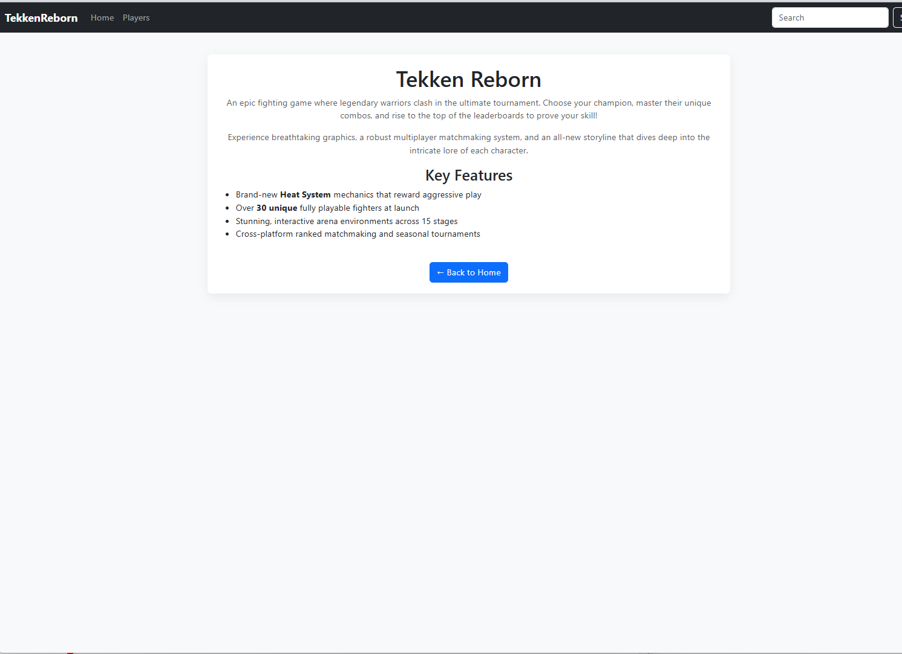
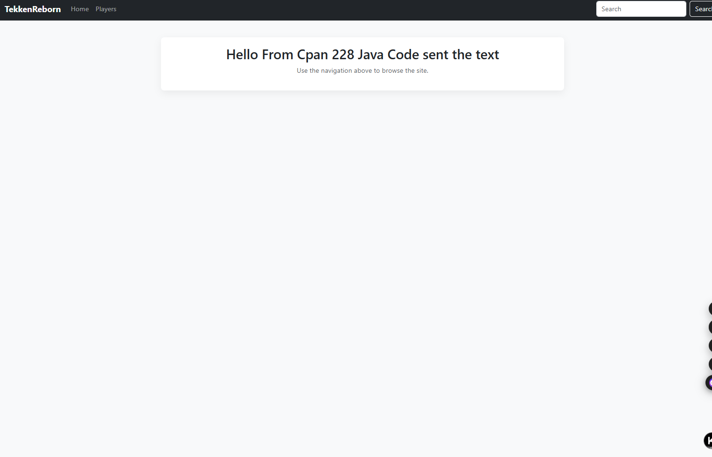
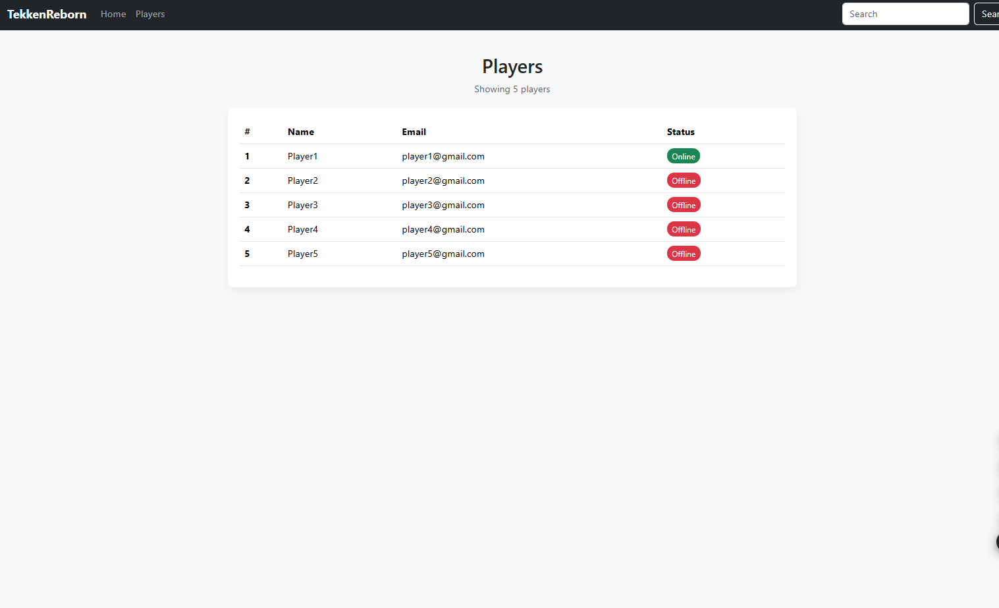
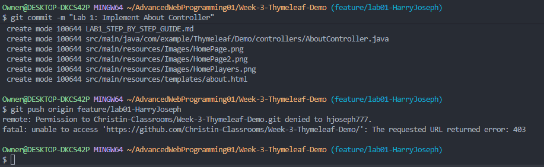

# CPAN 228 — Lab 1: Thymeleaf Demo

**Harry Joseph** · [@hjoseph777](https://github.com/hjoseph777) · CPAN 228 — Advanced Web Programming

---

## What This Lab Is About

This project is a Spring Boot + Thymeleaf web app built for Lab 1. The goal was to add a new `/about` page that displays info about a game called **Tekken Reborn**, wired up through a custom Spring MVC controller.

Below is a walkthrough of everything I did — the setup, the code, and how to run it yourself.

---

## Screenshots

Here's what the app looks like when it's running:

**Home Page**



**Home Page — Alt View**



**Players Page**



**Push Permission Error**



> When I first tried to push my feature branch, I got a permission error. The original class repository is read-only for students — you can clone and pull from it, but you **cannot push branches directly to it**. To work around this, the branch is pushed to your **own forked copy** of the repo instead, and then a Pull Request is opened from there back to the original.

---

## What I Built — Lab 1 Requirements

### The Controller

Created `AboutController.java` inside `src/main/java/com/example/Thymeleaf/Demo/controllers/`:

```java
package com.example.Thymeleaf.Demo.controllers;

import org.springframework.stereotype.Controller;
import org.springframework.web.bind.annotation.GetMapping;

@Controller
public class AboutController {

    @GetMapping("/about")
    public String getAboutPage() {
        return "about";
    }
}
```

This maps any `GET` request to `/about` and tells Spring to render the `about.html` template.

### The Template

Created `about.html` inside `src/main/resources/templates/`, following the same fragment pattern used by the rest of the project:

```html
<!DOCTYPE html>
<html lang="en" xmlns:th="http://www.thymeleaf.org">
<head>
    <meta charset="UTF-8">
    <title>About - Tekken Reborn</title>
    <div th:insert="fragments/base :: assetsHead"></div>
</head>
<body>
    <nav th:replace="fragments/navbar :: navbar"></nav>

    <div class="app-container text-center">
        <div class="players-card">
            <h1>Tekken Reborn</h1>
            <p class="text-muted">
                An epic fighting game where legendary warriors clash in the ultimate tournament.
                Choose your champion, master their unique combos, and rise to the top of the
                leaderboards to prove your skill!
            </p>
            <p class="text-muted">
                Experience breathtaking graphics, a robust multiplayer matchmaking system, and
                an all-new storyline that dives deep into the intricate lore of each character.
            </p>
            <h3>Key Features</h3>
            <ul class="text-start">
                <li>Brand-new <strong>Heat System</strong> mechanics that reward aggressive play</li>
                <li>Over <strong>30 unique</strong> fully playable fighters at launch</li>
                <li>Stunning, interactive arena environments across 15 stages</li>
                <li>Cross-platform ranked matchmaking and seasonal tournaments</li>
            </ul>
            <br>
            <a th:href="@{/}" class="btn btn-primary">&#8592; Back to Home</a>
        </div>
    </div>

    <div th:insert="fragments/base :: assetsScripts"></div>
</body>
</html>
```

---

## Saving and Submitting Your Work

Once everything is tested and working:

```bash
# Stage all changes
git add .

# Commit with the required message
git commit -m "Lab 1: Implement About Controller"

# Push to YOUR fork — not the original repo
git push origin feature/lab01-HarryJoseph
```

> **Why `origin` and not `upstream`?**
> The original class repository (`upstream`) is owned by the instructor — students don't have write permission to push branches there directly. `origin` refers to your own forked copy of the repo, which you do have full access to. Once your branch is pushed to your fork, you open a **Pull Request** from your fork back to the original repo for the instructor to review.

Then go to your fork on GitHub and click **"Compare & pull request"** to open a PR back to the original repo.

---

## Thymeleaf Quick Reference

| Attribute | What it does |
|---|---|
| `th:text` | Outputs escaped text from a variable |
| `th:utext` | Outputs raw/unescaped HTML |
| `th:href` | Generates a URL (use `@{/path}` syntax) |
| `th:src` | Binds an image or resource URL |
| `th:each` | Loops over a collection |
| `th:if` | Shows element if condition is true |
| `th:unless` | Shows element if condition is false |
| `th:object` | Binds a form to a model object |
| `th:field` | Binds an input to a model field |
| `th:errors` | Shows validation errors for a field |
| `th:replace` | Replaces the element with a fragment |
| `th:insert` | Inserts a fragment as a child element |
| `@{}` | URL expression |
| `${}` | Variable expression |
| `*{}` | Selection/object expression |

---

## Project Structure

```
src/
├── main/
│   ├── java/com/example/Thymeleaf/Demo/
│   │   ├── controllers/
│   │   │   ├── HomeController.java
│   │   │   ├── PlayersController.java
│   │   │   └── AboutController.java       ← added in this lab
│   │   └── ThymeleafDemoApplication.java
│   └── resources/
│       ├── templates/
│       │   ├── Home.html
│       │   ├── Players.html
│       │   └── about.html                  ← added in this lab
│       └── static/
```

---

> **Course:** CPAN 228 — Advanced Web Programming  
> **Lab:** 1 — Implementing Controllers & Thymeleaf Templates  
> **Author:** Harry Joseph | [github.com/hjoseph777](https://github.com/hjoseph777)
